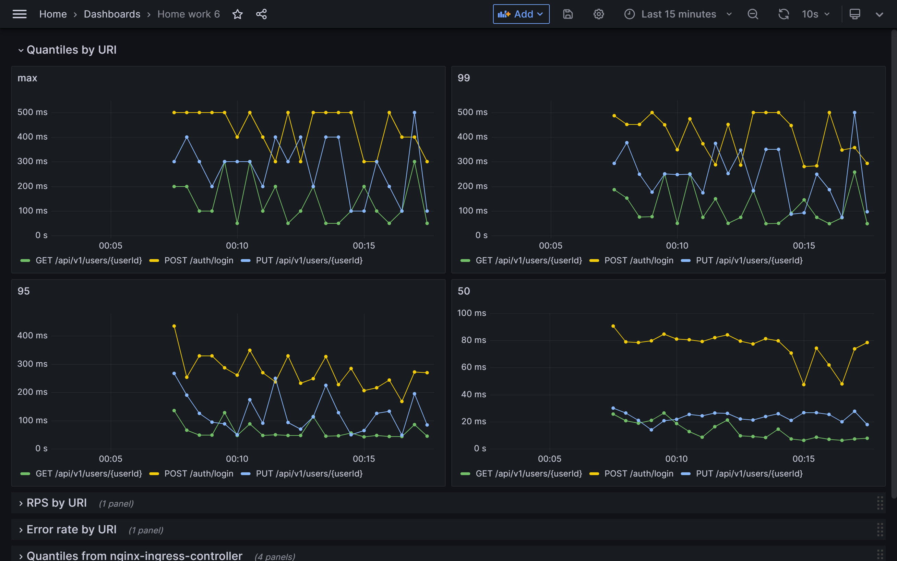
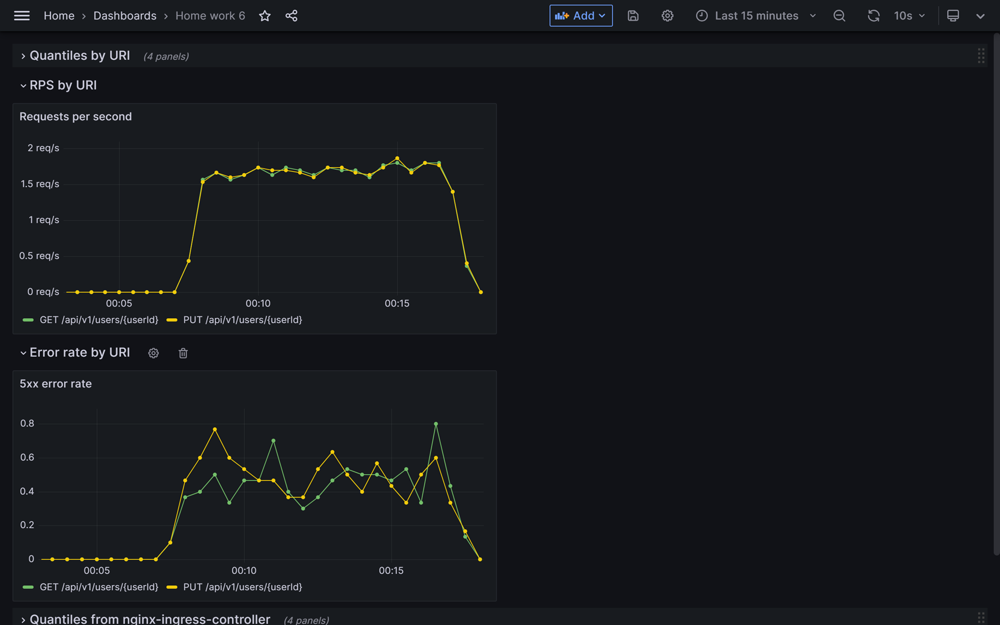
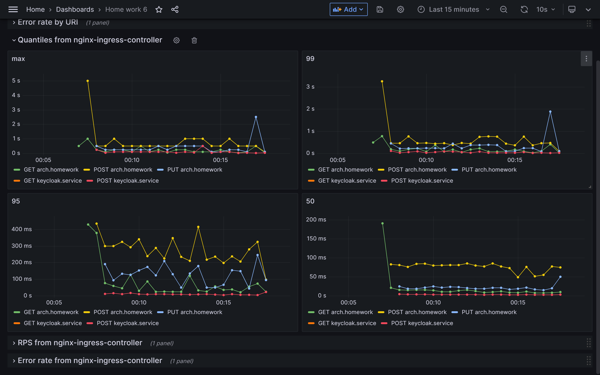
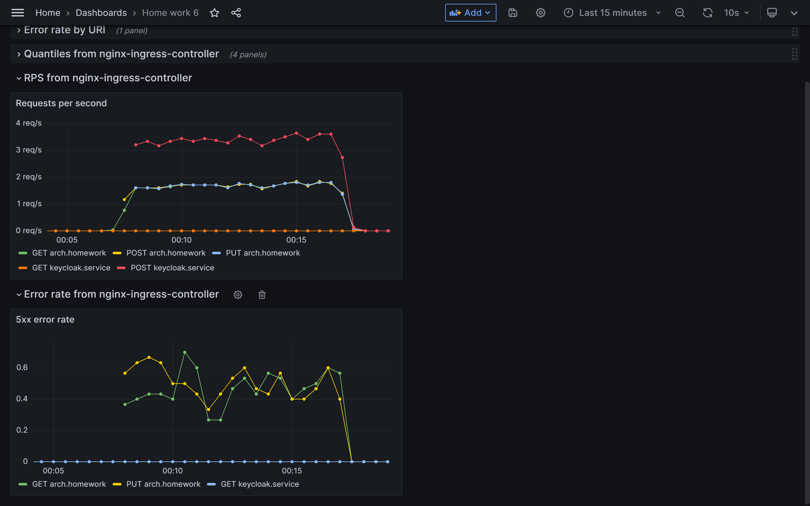

# Home Work 6 - Prometheus. Grafana

### Цель: инструментировать сервис.

### Описание/Пошаговая инструкция выполнения домашнего задания

Инструментировать сервис из прошлого задания метриками в формате Prometheus 
с помощью библиотеки для вашего фреймворка и ЯП.
Сделать дашборд в Графане, в котором были бы метрики с разбивкой по API методам:

1. Latency (response time) с квантилями по 0.5, 0.95, 0.99, max
2. RPS
3. Error Rate - количество 500ых ответов

Добавить в дашборд графики с метрикам в целом по сервису, взятые с nginx-ingress-controller:
4. Latency (response time) с квантилями по 0.5, 0.95, 0.99, max
5. RPS
6. Error Rate - количество 500ых ответов

Настроить алертинг в графане на Error Rate и Latency.

На выходе должно быть:
0. скриншоты дашборды с графиками в момент стресс-тестирования сервиса. Например, после 5-10 минут нагрузки.
1. json-дашборды.

Задание со звездочкой (+5 баллов)
Используя существующие системные метрики из кубернетеса, добавить на дашборд графики с метриками:
1. Потребление подами приложения памяти
2. Потребление подами приолжения CPU
Инструментировать базу данных с помощью экспортера для prometheus для этой БД.
Добавить в общий дашборд графики с метриками работы БД.

### Инструкция запуска

#### 1. Запуск кластера minikube в Docker на Windows
```
minikube start driver=docker
```
#### 2. Установка Prometheus и Ingress Nginx

Добавление репозитория чартов prometheus:
```
helm repo add prometheus-community https://prometheus-community.github.io/helm-charts
```
Установка чарта kube-prometheus-stack:
```
helm install prometheus prometheus-community/kube-prometheus-stack `
    -n prometheus --create-namespace `
    -f k8s/helm/prometheus/prometheus.yaml
```
Добавление репозитория чартов ingress-nginx:
```
helm repo add ingress-nginx https://kubernetes.github.io/ingress-nginx
```
Установка чарта ingress-nginx:
```
helm upgrade --install ingress-nginx ingress-nginx `
    --repo https://kubernetes.github.io/ingress-nginx `
    -n ingress-nginx `
    -f k8s/helm/ingress-nginx/ingress-nginx.yaml
```
или
```
helm upgrade --install ingress-nginx ingress-nginx `
    --repo https://kubernetes.github.io/ingress-nginx `
    --set-string controller.podAnnotations."prometheus\.io/scrape"="true" `
    --set-string controller.podAnnotations."prometheus\.io/port"="10254" `
    --set controller.metrics.enabled=true `
    --set controller.metrics.serviceMonitor.enabled=true `
    --set controller.metrics.serviceMonitor.additionalLabels.release="prometheus" `
    -n ingress-nginx --create-namespace
```

#### 3. Установка Keycloak

Создание Namespace "dev":
```
kubectl apply -f k8s/manifest/namespace
```
Создание ConfigMap с импортируемым realm:
```
kubectl create configmap -n dev keycloak-realm --from-literal=realm.name=otus --from-file=k8s/helm/keycloak/realm/realm.json
```
Создание Secret для Keycloak:
```
kubectl apply -f k8s/manifest/resource/secret
```
Обновление ConfigMap для Nginx Controller:
```
kubectl apply -f k8s/manifest/resource/configmap/keycloak-nginx-configmap.yaml
```
Установка Keycloak в кластер:
```
helm install keycloak -n dev oci://registry-1.docker.io/bitnamicharts/keycloak `
    --values k8s/helm/keycloak/values-dev.yaml
```
#### 4. Установка приложения с д/з №6
```
helm install home-work-6 -n dev -f k8s/helm/app/values-dev.yaml k8s/helm/app
```
#### 5. Открытие туннеля minikube
```
minikube tunnel
```
#### 6. Проверка через Postman CLI
[Установка Postman CLI](https://learning.postman.com/docs/postman-cli/postman-cli-installation/).
```
postman collection run postman/home-work-5.postman_collection.json --verbose
```
### Мониторинг

JSON панели мониторинга расположен в [grafana/HomeWork6.json](grafana/HomeWork6.json).

#### 1. Квантили по URI

#### 2. Частота запросов и 500-х ошибок по URI

#### 3. Квантили с Ingress Nginx

#### 4. Частота запросов и 500-х ошибок с Ingress Nginx
