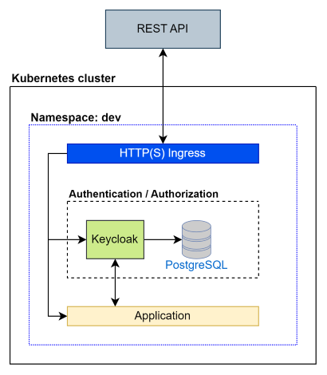
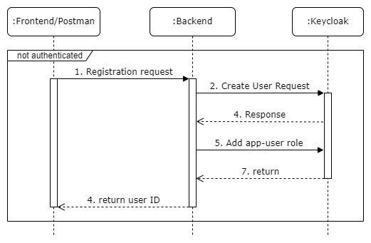
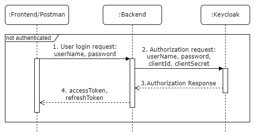
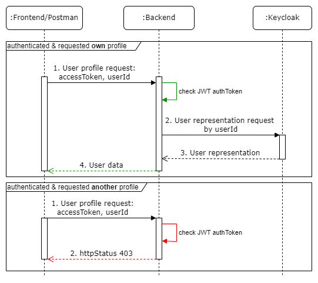

# Home Work 5 - Backend for frontends. Apigateway

### Цель: добавить в приложение аутентификацию и регистрацию пользователей.

### Описание/Пошаговая инструкция выполнения домашнего задания

Добавить в приложение аутентификацию и регистрацию пользователей.
Реализовать сценарий "Изменение и просмотр данных в профиле клиента".
Пользователь регистрируется. Заходит под собой и по определенному урлу получает данные о своем профиле. Может поменять данные в профиле. Данные профиля для чтения и редактирования не должны быть доступны другим клиентам (аутентифицированным или нет).
На выходе должны быть:
0) описание архитектурного решения и схема взаимодействия сервисов (в виде картинки)
1) команда установки приложения (из helm-а или из манифестов). Обязательно указать в каком namespace нужно устанавливать.
1*) команда установки api-gateway, если он отличен от nginx-ingress.
2) тесты постмана, которые прогоняют сценарий:
- регистрация пользователя 1
- проверка, что изменение и получение профиля пользователя недоступно без логина
- вход пользователя 1
- изменение профиля пользователя 1
- проверка, что профиль поменялся
- выход* (если есть)
- регистрация пользователя 2
- вход пользователя 2
- проверка, что пользователь2 не имеет доступа на чтение и редактирование профиля пользователя1.

В тестах обязательно:
- наличие {{baseUrl}} для урла
- использование домена arch.homework в качестве initial значения {{baseUrl}}
- использование сгенерированных случайно данных в сценарии
- отображение данных запроса и данных ответа при запуске из командной строки с помощью newman.

### Описание архитектуры

В качестве сервиса авторизации и аутентификации, а также для хранения зарегистрированных пользователей
используется identity-провайдер Keycloak.



### Схемы взаимодействия сервисов

#### 1. Регистрация нового пользователя

#### 2. Вход зарегистрированного пользователя

#### 3. Запрос зарегистрированным пользователем данных профиля


### Инструкция запуска

#### 1. Запуск кластера minikube в Docker на Windows
```
minikube start driver=docker
```
#### 2. Добавление ingress controller в minikube (включение minikube addon "ingress")
```
minikube addons enable ingress
```
#### 3. Установка Keycloak

##### 3.1. Создание Namespace "dev"
```
kubectl apply -f k8s/manifest/namespace
```
##### 3.2. Создание ConfigMap с импортируемым realm
```
kubectl create configmap -n dev keycloak-realm --from-literal=realm.name=otus --from-file=k8s/helm/keycloak/realm/realm.json
```
##### 3.3. Создание Secret для Keycloak
```
kubectl apply -f k8s/manifest/resource/secret
```
##### 3.4. Обновление ConfigMap для Nginx Controller
```
kubectl apply -f k8s/manifest/resource/configmap/keycloak-nginx-configmap.yaml
```
##### 3.5. Установка Keycloak в кластер
```
helm install keycloak -n dev --create-namespace oci://registry-1.docker.io/bitnamicharts/keycloak --values k8s/helm/keycloak/values-dev.yaml
```
#### 4. Установка приложения с д/з №5
```
helm install home-work-5 -n dev -f k8s/helm/app/values-dev.yaml k8s/helm/app
```
#### 5. Открытие туннеля minikube
```
minikube tunnel
```
#### 6. Проверка через Postman CLI
[Установка Postman CLI](https://learning.postman.com/docs/postman-cli/postman-cli-installation/).
```
postman collection run postman/home-work-5.postman_collection.json --verbose
```